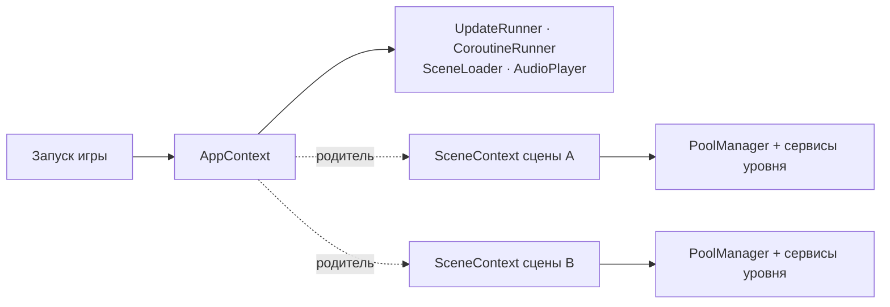

<div align="center">

# 🪶 FeatherKit

**Стартовый набор для Unity-игры: сервисы, пул, время, сцены, фидбек и инструменты.**

[](https://unity.com)
[](https://docs.unity3d.com/Manual/urp/urp-introduction.html)
[](https://docs.unity3d.com/Packages/com.unity.cinemachine@3.1/manual/index.html)
[](LICENSE.md)

</div>

---

## О библиотеке

FeatherKit закрывает ту часть работы, которая повторяется в каждом новом проекте: как
раздавать сервисы, откуда брать объекты, как ставить игру на паузу, как грузить уровни
и сохранять прогресс. Игровая логика остаётся в игре, библиотека даёт ей каркас.

Библиотека ничего не знает о конкретной игре, и это гарантирует компилятор: FeatherKit
собирается в отдельную сборку, игровые классы ей недоступны. Критерий попадания кода
сюда один: **он понадобится и в следующем проекте.**

## Возможности

- **Сервисы и контексты.** Корневой контекст на весь запуск, контекст на каждую сцену.
  Сервис регистрируется один раз и достаётся из любого места по типу.
- **Пул объектов.** Один реестр на сцену, один пул на префаб. Безопасные ссылки на объекты из пула.
- **Время и пауза.** Пауза по источникам, замедление, плавные переходы скорости.
  Кадровый апдейт и корутины для обычных классов без `MonoBehaviour`.
- **Уровни и сохранения.** Асинхронная загрузка с прогрессом, переезд между уровнями
  с затемнением, атомарная запись сохранений в JSON.
- **Здоровье и модификаторы.** Запас здоровья без понятия «урон», временные бонусы,
  множители и флаги с ключами и сроком жизни.
- **Боевой фидбек.** Летящие числа, полосы здоровья над объектами, вспышка при ударе,
  растворение, партиклы из пула. Готовые префабы под варианты.
- **Иконки над миром.** Каркас: рендер у края экрана, слежение за объектом, правила показа.
- **UI-заготовки.** Окна с очередью, подтверждение, бегущие числа, карусель, жесты,
  безопасная зона, перелёт иконки в цель.
- **Звук и камера.** Разовые звуки по каналам, источник из пула, тряска и зум для Cinemachine.
- **Рендер.** Тун-шейдер с обводкой и вспышкой, тун-шейдер для вершинной раскраски,
  туман по высоте, подмена рендерера на время сцены.
- **Отладка.** Цветной лог, текстовая консоль команд, панели «свойство — значение».
  Из релиза вырезается целиком.
- **Инструменты редактора.** Поиск использований ассета, перевод префабов в варианты
  с починкой ссылок, обзор материалов сцены.

## Требования

| Что | Версия |
|---|---|
| Unity | 6000.0 и новее |
| Universal Render Pipeline | 17 и новее |
| Cinemachine | 3 и новее |
| uGUI (TextMeshPro входит) | 2 и новее |

Зависимости объявлены в `package.json`, Package Manager установит их сам.

## Установка

**Package Manager.** `Window → Package Manager → + → Add package from git URL…` и вставить:

```
https://github.com/gspyart/FeatherKit.git
```

**Вручную.** Добавить строку в `Packages/manifest.json`:

```json
"com.gspy.featherkit": "https://github.com/gspyart/FeatherKit.git"
```

Чтобы зафиксировать версию, добавьте к ссылке метку или коммит: `…/FeatherKit.git#v0.1.0`.

---

## Как устроено

Три понятия, на которых держится всё остальное.

**Сервис** — обычный C#-класс, который делает одну вещь: считает очки, спавнит врагов,
хранит инвентарь. Без `MonoBehaviour`, зависимости приходят в конструктор.

**Контекст** — хранилище сервисов. Их два вида:

- `AppContext` — один на игру, живёт от запуска до выхода. Держит то, что переживает
  смену сцен: конфиг, сохранения, настройки звука.
- `SceneContext` — один на каждую загруженную сцену. Держит сервисы уровня и умирает
  вместе с ним. Родитель у него `AppContext`, поэтому из сцены видны и глобальные сервисы.

**Инсталлер** — компонент на сцене, который поднимает её контекст в `Awake` и гасит
в `OnDestroy`. Это единственный `MonoBehaviour`, который нужен, чтобы всё заработало.



### Что контекст заводит сам

Эти сервисы создаются вместе с контекстом. Заводить свои не нужно, а у первых четырёх
конструкторы закрыты.

| Сервис | Откуда взять | Как пользоваться |
|---|---|---|
| `UpdateRunner` | `AppContext.Current.Updates` | Реализовать `IUpdatable` в сервисе, остальное сделает контекст |
| `CoroutineRunner` | `AppContext.Current.Coroutines` | `Coroutines.Run(...)`, остановка по токену |
| `SceneLoader` | `AppContext.Current.Scenes` | `Scenes.Load(levelConfig)` |
| `AudioPlayer` | `AppContext.Current.Audio` | `Audio.Play2D(clip)`, `Audio.Play3D(clip, point)` |
| `PoolManager` | `SceneContext.Get<PoolManager>()` | `pool.Get(prefab, position, rotation)` |
| `GameTime`, `EventBus`, `DebugConsole`, `DebugPanel` | статические классы | доступны отовсюду |

---

## Быстрый старт

### 1. Корневой контекст

Наследник `AppContext` регистрирует глобальные сервисы. Точка входа запускает его
до загрузки первой сцены.

```csharp
public class GameContext : AppContext
{
    public GameConfig Config { get; private set; }

    protected override void RegisterServices()
    {
        Config = Resources.Load<GameConfig>("GameConfig");
    }
}

public static class EntryPoint
{
    [RuntimeInitializeOnLoadMethod(RuntimeInitializeLoadType.BeforeSceneLoad)]
    private static void Boot() => AppContext.Launch(new GameContext());
}
```

### 2. Контекст сцены

Наследник `SceneContext` регистрирует сервисы уровня. Зависимости передаются
в конструктор: по сигнатуре видно, что сервису нужно.

```csharp
public class BattleContext : SceneContext
{
    protected override void RegisterServices()
    {
        var score = Register(new ScoreCounter());

        Register(new EnemySpawner(Get<PoolManager>(), score));
    }
}
```

### 3. Инсталлер на сцене

Пустой объект на сцене с этим компонентом. Больше на сцене ничего настраивать не нужно.

```csharp
public class BattleInstaller : SceneContextInstaller<BattleContext> { }
```

### 4. Доступ к сервису

Компонент на сцене спрашивает контекст **через себя** (`this`): так он получит контекст
именно своей сцены, даже если загружено несколько.

```csharp
var score = AppContext.Current.GetContext<BattleContext>(this).GetRequired<ScoreCounter>();
```

`GetRequired` падает сразу и с именем типа, если сервис не зарегистрирован.
`Get` в той же ситуации вернёт `null`.

### 5. Фидбек в бою

- Перетащите на сцену префаб `Runtime/Prefabs/featherFeedbackCanvas`.
- Полоса здоровья: добавьте объекту компонент `HealthBarTarget`.
- Летящие числа: `FloatingTextController.Show(point, value)`. Когда и что показывать, решает игра.
- Вспышка при ударе: компонент `HitFlash` на объект, материалы на шейдере `FeatherKit/Toon Lit`.
  Материал-шаблон лежит в `Runtime/Materials/featherToonTemplate`.

---

## Справочник модулей

Подробности и обоснования решений лежат в комментариях к классам. Здесь только карта.

<details>
<summary><b>Contexts</b> — сервисы и их хранилища</summary>

| Класс | Назначение |
|---|---|
| `Context` | База хранилища. `Get` может вернуть `null`, `GetRequired` обязан найти |
| `AppContext` | Корень на весь запуск. `GetContext<T>(this)` отдаёт контекст сцены вызывающего |
| `SceneContext` | Контекст сцены, создаёт себе `PoolManager` |
| `SceneContextInstaller<T>` | Компонент-инсталлер: поднимает контекст в `Awake`, гасит в `OnDestroy` |
| `SceneServiceResolver` | Находит сценовый компонент или спавнит его из префаба |
| `FContextUtils` | `this.GetService<T>()` для любого компонента |
| `IInitializable`, `IReleasable` | `Init()` после регистрации всех сервисов, `Release()` при выгрузке в обратном порядке |

</details>

<details>
<summary><b>Pooling, Entities</b> — объекты из пула</summary>

| Класс | Назначение |
|---|---|
| `PoolManager` | Реестр пулов сцены. Выдаёт объект или сразу нужный компонент |
| `ObjectPool` | Пул одного префаба, используется только через `PoolManager` |
| `IPoolable` | Хуки `OnSpawned` и `OnDespawned` для сброса состояния |
| `PoolHandle<T>` | Ссылка, которая знает, что объект уже вернулся в пул |
| `FEntityBase` | База объектов из пула: рендереры, коллайдеры, теги, смысловой центр |
| `UnitTag` | Тег как ассет, сравнение по ссылке |
| `IObjectHeight` | Высота объекта для всего, что рисуется над ним |

</details>

<details>
<summary><b>Health, Modifiers</b> — изменяемые величины</summary>

| Класс | Назначение |
|---|---|
| `Health` | Запас здоровья. Что такое урон, решает игра |
| `HealthChange` | Операция над значением: прибавить, отнять, умножить, установить |
| `HealthChangedEvent` | Единственное событие ядра |
| `TimedModifiers<T>` | Вклады по ключам со сроком жизни. Наследники `TimedBonuses`, `TimedMultipliers`, `TimedOffsets`, `TimedFlags` |

</details>

<details>
<summary><b>GameTiming, Updatables, Coroutines, Timers</b> — время</summary>

| Класс | Назначение |
|---|---|
| `GameTime` | `DeltaTime` для игры, `UnscaledDeltaTime` для UI. Пауза по источникам, замедление. Единственный владелец `Time.timeScale` |
| `IUpdatable`, `UpdateRunner` | Кадровый апдейт для сервисов контекста |
| `CoroutineRunner`, `CoroutineToken` | Корутины для обычных классов, переживают смену сцены |
| `Cooldown` | Отсчёт времени без `MonoBehaviour` |
| `IProgressable` | Прогресс 0..1 для полос загрузки |

</details>

<details>
<summary><b>Scenes, Saving</b> — уровни и сохранения</summary>

| Класс | Назначение |
|---|---|
| `SceneLoader` | Асинхронная загрузка с прогрессом, аддитивная, события этапов |
| `LevelConfig` | Уровень как данные, игра дописывает свои поля наследником |
| `LevelTransition` | Переезд целиком: затемнение, смена сцены, проявление |
| `ScreenCurtain`, `LoadingScreenView` | Заслонка и экран загрузки, заготовки под свой вид |
| `SaveStorage` | JSON в файл с атомарной записью. Только хранилище |

</details>

<details>
<summary><b>Events, Registry, StateMachine, Collections</b> — связки</summary>

| Класс | Назначение |
|---|---|
| `EventBus` | Типизированная шина без очередей и приоритетов |
| `TypeRegistry<T>` | Список живых объектов типа, безопасный при удалении во время обхода |
| `StateMachine`, `IState` | Переключение состояний и их апдейт |
| `WeightedRandom<T>` | Взвешенный случайный выбор |

</details>

<details>
<summary><b>Feedback</b> — отклик на события</summary>

| Класс | Назначение |
|---|---|
| `FloatingTextController`, `FloatingText`, `FloatingTextAnimationConfig` | Летящие числа, стиль задаёт префаб |
| `HealthBarController`, `HealthBarTarget`, `HealthBarView` | Полосы здоровья на экранном канвасе |
| `HitFlash` | Заливка модели цветом при ударе, нужно свойство `_HitFlash` в шейдере |
| `DitherFade`, `MaterialCopies` | Растворение объекта и копии материалов для него |
| `PooledEffect` | Партикл из пула, возвращается сам |
| `UiShake` | Дрожь элемента как жест «нельзя» |

</details>

<details>
<summary><b>Icons</b> — иконки над миром</summary>

Каркас из трёх слоёв: рендер, слежение, правила. Конкретные правила показа игра
описывает наследниками `IconRule`.

| Класс | Назначение |
|---|---|
| `IconsRenderer` | UI-объекты в точках мира, прижатие к краю экрана, расталкивание |
| `IconsTracker`, `TrackedIcon` | Держат иконку над объектом или точкой |
| `IconRule`, `IconRulesRunner`, `IconRuleContext` | Правила-ассеты: кому и когда показывать |
| `IconRequest`, `IconView`, `OffscreenMode` | Заявка на иконку, база скрипта иконки, поведение за экраном |

</details>

<details>
<summary><b>UI</b> — заготовки интерфейса</summary>

| Класс | Назначение |
|---|---|
| `UiWindowBase`, `ConfirmWindow`, `IShowHideAnimation` | Окно с `Open`, `Close`, `Toggle`, очередь окон, анимация показа |
| `UiBounce`, `UiPressBounce`, `TotalGrowthBounce` | Прыжок масштабом по событию, нажатию, росту числа |
| `RollingNumberText` | Бегущее число в TextMeshPro |
| `FlyingIcon` | Перелёт картинки из мира или UI в цель |
| `UiCarousel`, `UiGestureRecognizer` | Карусель карточек, жесты: тап, удержание, перетаскивание |
| `ScrollList`, `ScrollEdgeFade`, `GridCellFitter`, `ViewList`, `UiObjectPool` | Списки, мягкий край прокрутки, сетка, ряд вьюх из префаба |
| `SafeAreaFitter`, `FullScreenRect` | Безопасная зона, растяжка на весь холст |

</details>

<details>
<summary><b>Audio, CameraEffects, Navigation, Rendering</b></summary>

| Класс | Назначение |
|---|---|
| `AudioPlayer` | Разовые звуки 2D и 3D по кругу каналов, без спавна объектов |
| `PooledAudioSource` | Источник звука из пула: зациклить, оборвать, перемещать |
| `CameraShake`, `ShakeProfile`, `CameraZoom` | Тряска и зум для Cinemachine |
| `NavMeshPathfinder`, `ObstacleScanner` | Направление по навмешу без `NavMeshAgent`, обход препятствий лучами |
| `HeightFogVolume` | Туман по высоте через Volume, нужна `HeightFogFeature` в рендерере |
| `ToonLitSettingsFeature` | Общие настройки тун-шейдера на проект |
| `CameraRendererOverride`, `RenderPipelineOverride` | Свой рендерер или ассет URP на время сцены |

</details>

<details>
<summary><b>Debugging</b> — отладка</summary>

| Класс | Назначение |
|---|---|
| `FLog`, `FLogColor`, `FLogPart` | Лог из цветных кусков. `Info` и `Warning` вырезаются из релиза |
| `DebugConsole`, `DebugCommand`, `DebugCommandButton` | Текстовые команды вроде `gold 500`. В релизе не регистрируются |
| `DebugPanel`, `DebugAnchor`, `DebugPanelStyle` | Панели «свойство — значение» на экране. В релизе вырезаются |
| `FGizmos` | Гизмо: силуэт префаба, стрелки, дуги |

</details>

<details>
<summary><b>Helpers</b> — расширения</summary>

| Класс | Назначение |
|---|---|
| `FComponentUtils` | `GetOrAddComponent`. Единственный класс вне пространства имён |
| `FCollectionUtils` | Случайный элемент, выборка без повторов, перемешивание |
| `FVector3Utils`, `FTransformUtils` | `ReplaceX/Y/Z`, `SetX/Y/Z`, телепорт с `Rigidbody` |
| `FDistanceUtils`, `FDirectionUtils`, `FGroundUtils` | Дистанции по плоскости с учётом радиусов, ввод в мировое направление, посадка на землю |
| `FCameraUtils`, `ScreenPoint` | Видимость объекта, перевод точки мира или UI в пиксели экрана |
| `FNumberUtils`, `FTimeFormatUtils` | Форматы `10K`, `x12`, `+5`, `12:34` |
| `FObjectIdUtils` | Стабильный номер объекта на любой версии Unity |
| `FDescriptionAttribute` | Описание компонента в инспекторе |

</details>

<details>
<summary><b>Editor</b> — инструменты редактора</summary>

| Инструмент | Где найти |
|---|---|
| Поиск использований ассета | ПКМ по ассету → `Найти использования` |
| Перевод префабов в варианты шаблона с починкой ссылок | ПКМ по префабам → `Сделать вариантами шаблона…` |
| Обзор материалов сцены | `FeatherKit → Материалы сцены` |
| Назначение иконок ассетам | `FeatherKit → Asset Icons` |
| Гизмо в Game View | `FeatherKit → Гизмо в Game View` |
| Инспекторы тун-шейдеров, база для своих инспекторов | `ToonLitShaderGUI`, `ToonTerrainShaderGUI`, `FeatherEditor` |

</details>

---

## Готовые ассеты

### Префабы

Лежат в `Runtime/Prefabs`. Это нейтральные заготовки под **варианты**: создайте вариант
(ПКМ → Create → Prefab Variant) и настраивайте его, оригинал не трогайте.

| Префаб | Что это |
|---|---|
| `featherFeedbackCanvas` | Канвас с летящими числами и полосами здоровья, один на сцену |
| `featherFloatingText` | Одна летящая надпись, вид задаёт её TextMeshPro |
| `featherHealthBar` | Полоса здоровья: фон, хвост урона, шкала |
| `featherPooledAudioSource` | Источник звука из пула |
| `featherPooledEffect` | Партикл из пула |
| `featherFloatingTextAnimation` | Настройки полёта надписей: высота, разброс, кривые |

Шрифт у `featherFloatingText` не задан намеренно: TextMeshPro подставит шрифт проекта.

### Шейдеры

| Шейдер | Что это |
|---|---|
| `FeatherKit/Toon Lit` | Ступенчатый свет, обводка, вспышка удара, растворение. Шаблон материала `featherToonTemplate` |
| `FeatherKit/Toon Terrain` | То же для мешей с вершинной раскраской, до четырёх слоёв |
| `FeatherKit/Height Fog` | Туман по высоте, настраивается через `HeightFogVolume` |
| `FeatherKit/Masked Swirl` | Декоративный UI-эффект свечения |

---

## Принципы

- **Ядро не знает про игру.** Всё игровое игра подставляет сама.
- **Никаких поисков по сцене в рантайме.** Объект сам регистрируется в сервисе в `OnEnable`.
- **Статика сбрасывается при входе в игру** через `RuntimeInitializeOnLoadMethod`,
  чтобы работать с выключенной перезагрузкой домена.
- **Зависимости приходят в конструктор.** Контекст передаётся только если иначе никак,
  тогда сервис достаёт нужное в `Init()`.
- **Префикс `F`** отличает классы библиотеки от похожих в Unity: `FLog` и `Debug.Log`,
  `FGizmos` и `Gizmos`.
- **Файлы ассетов с префиксом `feather`** и с маленькой буквы.
- **Комментарий объясняет, почему так, а не что происходит.**

## Ограничения

- Сохранения через `JsonUtility`: только поля `[Serializable]`-классов, без словарей,
  свойств и полиморфизма.
- Туман по высоте работает только с Render Graph.
- `HitFlash` ждёт в шейдере свойства `_HitFlash` и `_HitFlashColor`, имена настраиваются.
- Дистанции и направления в `Helpers` и `Navigation` считаются по плоскости XZ.
  Для вертикального геймплея нужны свои.
- В библиотеке нет локализации, аналитики, сети и ECS, и они не планируются.

## Разработка

Для правок в самой библиотеке удобнее подключить её как локальный пакет. Клонируйте
репозиторий рядом с проектом и укажите путь в `Packages/manifest.json`:

```json
"com.gspy.featherkit": "file:../../FeatherKit"
```

Unity покажет пакет как редактируемый, изменения сразу попадут в клон.

## Лицензия

[MIT](LICENSE.md) © gspy. Свободное использование с сохранением авторства.
